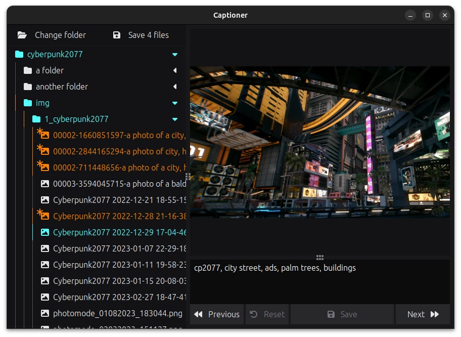

# Captioner

Simple image caption manager.

I needed an easy way to see simultaneously the caption and the image I am captioning for training Stable Diffusion LoRA, so I made this.

Built on [Neutralinojs](https://neutralino.js.org/) and [Svelte](https://svelte.dev/) with [TailwindCSS](https://tailwindcss.com/).

## Features

- Adjustable UI panes
- Subfolder support
- Remembers changes in multiple files (you can save them at once)

## Keyboard Shortcuts

- `PageUp` (or `ArrowUp` when caption is not focused) - Open previous image in folder
- `PageDown` (or `ArrowDown` when caption is not focused) - Open next image in folder
- `Ctrl`+`S` - Save currently open caption
- `Ctrl`+`Alt`+`S` - Save all unsaved captions

## Installation

This project doesn't have an installer, it's a single binary and a resources file.  
Here is what you need to do to get it running:

1. Download the right zip for your system from the [GitHub releases page](https://github.com/Zhincore/dynmap-trains/releases/latest).
2. Unzip it in location of your choice.
3. Continue with the [Usage section](#usage)

## Usage

1. Start the `captioner-` executable
2. Click on the opened window and choose folder with your images
3. Click on one of them in the filebrowser pane on the left
4. Write your description in the box bellow the shown image
5. Profit!

Either save your caption after writing it or save them all once you caption all of them... or ideally both!  
Once you close the window Captioner will exit automatically.

### Modes

Neutralino is providing us with these modes: 

- `window` (default) - Opens a standalone window (on Ubuntu I tend to experience performance issues with this mode)
- `browser` - Opens Captioner in your default browser
- `chrome` - Opens Captioner in a chrome-based browser and attempts to make it look like a native app

You can set the mode using the cli parameter `--mode=<mode>`, either by making a link to the executable and editing it (in Windows) or in command line.

## Development 

1. `pnpm i`
2. `pnpm dev`

## Building

Run `pnpm dist` to build the project and create zip files for each supported platform in `dist/` folder.  

Or run `pnpm build` directly if you don't need zip files and the binaries will be in `dist/captioner/`.  
To run the built project you need a `captioner-*` binary and the `resources.neu` file.
